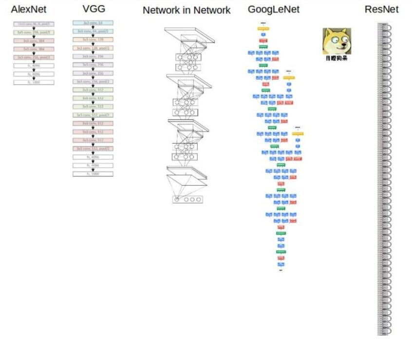
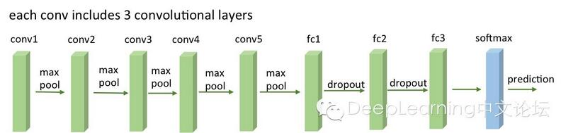
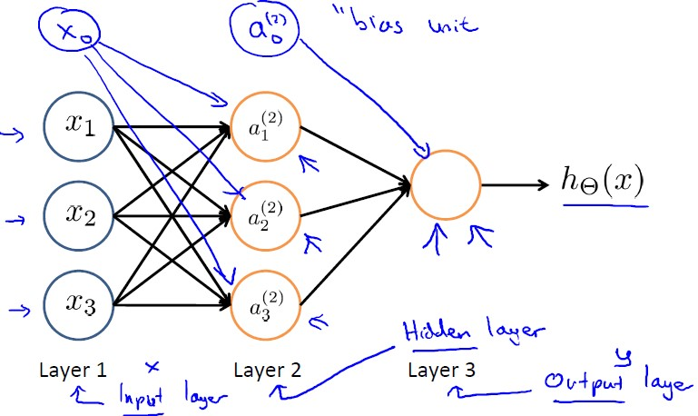
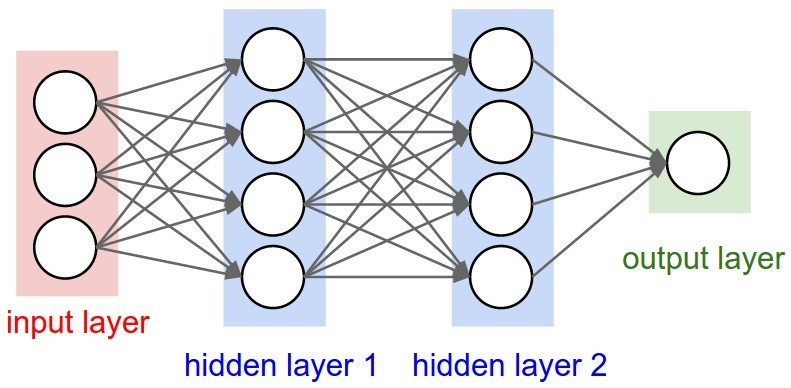

deep learning

### What is the difference between ML and DL?
机器学习，就是利用计算机、概率论、统计学等知识，通过给计算机程序输入数据，让计算机学会新知识，是实现人工智能的途径，但这种学习不会让机器产生意识。机器学习的过程，就是通过训练数据寻找目标函数。数据质量会影响机器学习精度，所以数据预处理非常重要。 
深度学习是机器学习的一种，现在深度学习比较火爆。在传统机器学习中，手工设计特征对学习效果很重要，但是特征工程非常繁琐。而深度学习能够从大数据中自动学习特征，这也是深度学习在大数据时代受欢迎的一大原因。是机器学习的一类，本质上就是之前机器学习的神经网络算法。 
深度学习目前在Speech Recognition、image classification等领域特别在行。 

### 怎么理解神经网络训练过程中的epoch、iteration和batch size三个概念
深度学习中经常看到epoch、 iteration和batchsize，这三个的区别： 
（1）batchsize：批大小。在深度学习中，一般采用SGD训练，即每次训练在训练集中取batchsize个样本训练而不是对所有样本进行整个训练； 
（2）iteration：1个iteration等于使用batchsize个样本训练一次； 
（3）epoch：1个epoch等于使用训练集中的全部样本训练一次。Epoch次数就是一共迭代1000次比如，然后找最优解。 
举个例子，训练集有1000个样本，batchsize=10，那么训练完整个样本集需要100次iteration，1次epoch。 

### What is the difference between Keras and TensorFlow?
......(体会不深因Keras用的太少) 

### 梯度消失，梯度爆炸？

### What is Reinforcement Learning?
人的一生其实都是不断在强化学习，当你有个动作（action）在某个状态（state）执行，然后你得到反馈（reward），尝试各种状态下各种动作无数次后，这几点构成脑中的马尔可夫模型，使你知道之后的行为什么为最优。所以你现在才知道什么东西好吃，什么东西好玩。 
加强学习最重要的几个概念：agent，环境，reward，policy，action。环境通常利用马尔可夫过程来描述，agent通过采取某种policy来产生action，和环境交互，产生一个reward。之后agent根据reward来调整优化当前的policy。 
例子：撩妹的过程就是一个优化问题。你的每一时刻的行为会对你最终撩妹是否成功，以多大的收益成功都会有影响。那么，你就会考虑，每一步采取什么行为才能（最优）撩妹！这可以看作一个RL问题。你肯定迫不及待的想知道怎么去求解了！假设1:你是第一次撩妹。那么你会去求教他人，逛各种论坛，总之收集大量相关知识。这个过程就是experience data。利用离线数据来train一个model。假设2:过去你有很多撩妹经验。你似乎又发现总是按照套路来并不能成功。嗯，经典的探索与利用问题，于是你尝试了其他方法，你发现获得了更好的效果。嗯，more optimal policy将上述过程对应到RL中：action：你的行为state：你观察到的妹子的状态reward：妹子的反应：开心or不开心。 
出处： https://www.zhihu.com/question/31140846

### Keras的Conv1d到Conv4d的区别
在Keras或者Theno或者TensorFlow中声明卷积层convolutional layer的时候，需要指明filter_shape is a tuple of (num_filter, num_channel, height, width)，即num_filter是卷积核个数，然后是通道数，filter的高乘以宽。疑问可以看这篇帖子：https://stackoverflow.com/questions/36243536/what-is-the-number-of-filter-in-cnn 
Conv1d用于NLP或Speech Recognition，因为文字和声音都是一维的。 
Conv2d用于Image Classification，因为图片是二维的。 
Conv3d用于立体空间Classification。 
Conv4d用于Video处理视频，加上了时间维。 

### 研究不同课题的最优卷积核以更好地提取特征甚至可以作为Phd的paper topic，人脸识别、猫狗识别都可使用不同的卷积核以获取不同的特征类别。

### 当下流行的几种CNN卷积神经网络的比较
现在的CNN模型都是在GoogleNet、VGGNet或者AlexNet上调整的 
  
 Alexnet，2012年，Imagenet比赛冠军，证明了CNN在复杂模型下的有效性，然后GPU实现使得训练在可接受的时间范围内得到结果，确实让CNN和GPU都大火了一把，顺便推动了有监督DL的发展。 
 GoogleNet-googlenet，14年比赛冠军的model，这个model证明了一件事：用更多的卷积，更深的层次可以得到更好的结构。（当然，它并没有证明浅的层次不能达到这样的效果）。 
 VGG有很多个版本（VGG-16或VGG-19，16或19是含有参数的layer的个数，也算是比较稳定和经典的model。它的特点也是连续conv多，计算量巨大（比前面几个都大很多）。具体见下图，全部使用了3*3的小型卷积核和2*2的最大池化核。 
  
 Deep Residual Learning-ResNet-深度残差网络-15年的imagenet比赛冠军，但在深度残差网络中，我们可以让特征不必完全“堆叠”，特征可以直接向后传递，第1层输出的特征不必像传统的卷积神经网络那样经过前N-1层的叠加才能进入第N层，在深度残差网络中，第1层的特征可以越过中间N-1层而直接进入到第N层。从现实意义上来讲，这么做当然是有道理的。这使得我们的特征提取更加丰富，而且也解决了传统BP神经网络（包括卷积神经网络）层数太多时的梯度消失问题。 
 可以看到，目前cnn model的设计思路基本上朝着深度的网络以及更多的卷积计算方向发展。虽然有点暴力，但是效果上确实是提升了。当然，我认为以后会出现更优秀的model，方向应该不是更深，而是简化。 

### 简述卷积神经网络Convolutional Neural Network CNN的大致过程和原理
下面是我们看到的图片和计算机看到的图片的区别： 
  
## 第一步，我们要做的就是添加卷积层Convolution layer求卷积，用filter（或者叫卷积核，滤波矩阵，kernel，neurons-神经元们，在Keras里我们可以自由指定卷积核的个数，一般第一个卷积层32个（32个卷积核，32种卷积核，32个神经元，得到32种feature map，获取到原图的32种特征-比如肤色-轮廓-发色-脸型-衣着-是否光头等），第二个64，第三个128，第四个256，都是16的倍数以方便GPU处理，也就是所使用的neurons的个数，越多第一层结束后提取出的feature maps就越多，也就是获取到了更多的原图的特征。比如我们进行人脸识别，就可以获取到这个人脸图的轮廓特征、颜色-肤色特征、五官位置特征等等，这些都是使用不同的神经元也就是卷积核“提取”出来的）。 
比如对下面这张32乘以32乘以3（最后的3代表RGB即channels也就是3原色的彩色图，如果我们的目标是字母A到Z这种无所谓颜色的，可以用cv软件处理成灰度图，那么channels就等于1了。当然你作人脸识别肯定用channels=1肯定不行，否则人的肤色就无法识别了）的图，经过多个5乘以5乘以3（最后一个3也是channels，要等于原图的channels）的卷积核扫描，变成了右侧32-5+1=28乘以28再乘以3（3也是通道数）的图： 
  
  
既然有卷积核filter，那就有stride步长（一次卷积核平移或纵移的位置）和padding（当卷积核扫描可能超出图片范围时，我们用啥来补其图片）一说。下面是stride的动图： 
  
  
  
讲padding的： 
  
## 第二步，卷积层后面加一个激活层Activation layer应用Relu Function
首先，为什么需要激活函数？ 模拟人的神经系统，只对部分神经元的输入做出反应。这样用Relu这种单侧抑制，有些神经元的输出就不会另我们做出反应。防止过拟合。 
其次，为什么采用非线性激活函数？如果是采用线性函数，那么多层神经网络也只有线性映射能力，输出都是输入的线性组合，与没有隐层一样。 
最后，采用哪些非线性激活函数？最常用的sigmoid,tanh,relu...在过去，研究人员主要利用双曲正切tanh或S函数sigmoid作为非线性函数进行处理，后来大家发现线性整流层ReLU效果更佳，由于其计算效率能够大大加快整个系统训练的速度。同时它能减轻梯度消失问题vanishing gradient problem，这个问题主要出现在训练时，由于梯度呈指数下降而导致的底层训练十分缓慢的问题。 
Relu主要用于每个卷积层之后紧跟的激活层，最后的激活层一般还是用Sigmoid因为output是classification，我们要知道猫狗辨别得到这个物体是猫的概率80%、是狗的概率15%、是鸟的概率5%这种。 
## 第三步，池化层（MaxPooling2D layer）作downsampling下采样
  
 那么池化层是干什么的呢？池化，英文是pooling，字面上看挺难懂，但其实这可能是CNN里最简单的一步了。我们可以不按字面理解，把它理解成下采样（subsampling）。池化分为最大值池化和平均值池化，和卷积差不多，也是取一小块区域，比如一个5*5的方块，如果是最大值池化，那就选这25个像素点最大的那个输出，如果是平均值池化，就把25个像素点取平均输出。这样做有什么好处呢？1、应该很明显可以看出，图像经过了下采样尺寸缩小了，按上面的例子，原来5*5的一个区域，现在只要一个值就表示出来了！2、增强了旋转不变性，池化操作可以看做是一种强制性的模糊策略，举个不恰当的例子，假设一个猫的图片，猫的耳朵应该处于左上5*5的一个小区域内（实际上猫的耳朵不可能这么小），无论这个耳朵如何旋转，经过池化之后结果都是近似的，因为就是这一块取平均和取最大对旋转并不care。当然和之前的卷积一样，池化也是层层递进的，底层的池化是在模糊底层特征，如线条等，高层的池化模糊了高级语义特征，如猫耳朵。所以，一般的CNN架构都是三明治一样，卷积池化交替出现，保证提取特征的同时也强制模糊增加特征的旋转不变性。 
## 上面卷积层-激活层-池化层会有若干个
## 第四步，Flatten层-用来将输入“压平”，即把多维的输入一维化，常用在从卷积层到全连接层的过渡
## 第五步，全连接层Flatten()-对应Keras的Dense(256, activation='relu')
Dense就是常用的全连接层，所实现的运算是output = activation(dot(input, kernel)+bias)。其中activation是逐元素计算的激活函数，kernel是本层的权值矩阵，bias为偏置向量，只有当use_bias=True才会添加。 
全连接层相当于对之前所有卷积-激活-池化层得到的所有特征进行总结，然后依据这些特征将样本映射到对应的分类标记（0-猫，1-狗）上面去。比如： 
假设你是一只小蚂蚁，你的任务是找小面包。你的视野还比较窄，只能看到很小一片区域。当你找到一片小面包之后，你不知道你找到的是不是全部的小面包，所以你们全部的蚂蚁开了个会，把所有的小面包都拿出来分享了。全连接层就是这个蚂蚁大会~ 
  
  
  
  
  
  
## 第六步，Dropout层，Dropout(0.5)-为输入数据施加Dropout，Dropout将在训练过程中每次更新参数时按一定概率随机断开输入神经元（扔掉一些神经元），Dropout层用于防止过拟合

### 简述LSTM Long Short Term Memory-RNN Recurrent Neural Network神经网络的大致过程和原理

如果我们说过的话太多、要记忆的东西太久，就会遗忘。同理，RNN如果中间的layers很多，也会发生Gradient Descent不收敛或者持续震荡，在这种情况下，经过改进得到的LSTM就可以胜任。加什么remember/forget gate。 
I think you confuse "LSTM cell" with LSTM layer argument named "units".
In Keras, LSTM(units=N) means that every cell of LSTM layer have N neurons (at every moment the hidden state is vector with size N). LSTM需要的数组格式： [样本数，时间步伐，特征] 

### Multiple Layer Perceptron案例1：Truven Customer Opportunity Win or Loss-使用TensorFlow
参看mlp-对MergeOpportunityLossPred进行改进后得到，使用两个hidden layers的mlp，不像之前只有1层，准确率82%提升了1%.py 
Hung for Long. Whether an opportunity was stuck in same stage for at least ten transactions. 
Back and Forth Index: Number of times an opportunity went either back or forth. 
Forward Count: number of times an opportunity went “net” forward (moved ahead to a different sales stage more on “n” occasions than backward. 
AMOUNT_MAX: Total Sales Order Amount 
... 
TGT_LOST 
使用softmax_cross_entropy_with_logits就是交叉熵crossentropy下面有介绍 

### CNN案例1：猫狗识别（医学影像肺癌检测）-cat_dog.html-使用keras
 标准的convolutional neural network作图片classification。训练数据是600MB的猫和狗的图片，一共25000张.jpg，训练2、3个小时。比如cat.18.jpg和dog.11853.jpg 
 (200, 3, 64, 64)-经过处理后得到的training set-200张3通道RGB的64*64猫狗图片，声明为numpy的ndarray类型 
 (10, 3, 64, 64)-test set 
  
 经过所有层之后，最后进入 
 model.add(Dense(1)) 
 model.add(Activation('sigmoid')) 
 真正地输出为0/1即一维结果，使用sigmoid作分类。而 
 model.compile(loss=objective, optimizer=optimizer, metrics=['accuracy']) 
 用于定义optimizer（每个Keras的神经网络都必须有的东西），loss函数可以设计为不同种（即用不同的loss函数实现最优optimizer），这里是binary_crossentropy，对连续型问题可以使用mean_squared_error，对二分类问题也可以使用binary_accuracy:计算在所有预测值上的平均正确率等等很多种。 
 处理overfitting，这里采用了keras自带的early stopping策略。什么叫early stopping，就是边跑epoch进行训练、边记录和输出loss即误差、当发现跑出额外的10个epoch之后、loss依旧没有明显下降、就说明此刻的CNN模型已经处于overfitting了、那么这时keras能够自动退回到这10个epoch之前的状态、将那时的CNN输出作为最终model。 
 LossHistory继承自Callback类。调用keras自带的EarlyStopping函数、patience=3就说明我们最多能容忍我们的model在未来3步之内loss没有明显下降、再多步的话、就认为当前model发生overfitting了。 
 在调用model.fit()进行拟合时，validation_split=0.2即拿出20%的数据进行overfitting的validation、callback设为history和early_stopping、history是为了把每一次的误差loss记录下来、early_stopping是为了检测当前model是否overfitting、epoch就是跑一个批次（跑一轮）、batch_size就是每次跑10个样本 
 结果中打印出epoch=00005代表只跑到第5轮就结束了、发生了early stopping 
 从下面给出的epoch和loss的plot可以看出，对validation loss而言、在第0 1 2三次epoch时、它都在下降、即整个model在往好的方面发展、但到第epoch=3时、validation loss开始反弹、说明此刻的model可以很好地fit训练数据Training loss、却不能很好地fit验证数据validation loss 

### 上述案例在用Keras训练的过程中采用了Loss=crossentropy交叉熵函数的意义？
交叉熵可在神经网络(机器学习)中作为损失函数，p表示真实标记的分布，q则为训练后的模型的预测标记分布，交叉熵损失函数可以衡量p与q的相似性。交叉熵作为损失函数还有一个好处是使用sigmoid函数在梯度下降时能避免均方误差损失函数学习速率降低的问题，因为学习速率可以被输出的误差所控制。 
换句话说，人在学习分析新事物时，当发现自己犯的错误越大时，改正的力度就越大。比如投篮：当运动员发现自己的投篮方向离正确方向越远，那么他调整的投篮角度就应该越大，篮球就更容易投进篮筐。同理，我们希望：神经网络在训练时，如果预测值与实际值的误差越大，那么在反向传播训练的过程中，各种参数调整的幅度就要更大，从而使训练更快收敛。然而，如果使用二次代价函数训练神经网络，看到的实际效果是，如果误差越大，参数调整的幅度可能更小，训练更缓慢。所以我们引入交叉熵函数作为代价函数，用该函数表示输出值与实际值之间的误差。 
所以，当误差越大，梯度就越大，参数w调整得越快，训练速度也就越快。实际情况证明，交叉熵代价函数带来的训练效果往往比二次代价函数要好。而激活函数Sigmoid也是一样的道理，使用Sigmoid函数，w和b的梯度跟激活函数的梯度成正比，激活函数的梯度越大，w和b的大小调整得越快，训练收敛得就越快。 

### LSTM-RNN案例1：猜下一个单词/字母-word_rnn.html-相关解读参见（自己研究的，做输入法会很有用）
使用到的一些库： 
import nltk 
from keras.models import Sequential 
from keras.layers import Dense 
from keras.layers import Dropout 
from keras.layers import LSTM 
from keras.callbacks import ModelCheckpoint  
from keras.utils import np_utils 
from gensim.models.word2vec import Word2Vec 
training data是很多.txt文件，都放在一个路径下，里面是小说或者各式新闻等文章。

### LSTM-RNN案例2：stock price prediction-使用TensorFlow
 先不整了。

### 补充
神经网络每一层的每个neuron都有权重矩阵weights、偏置bias，正如下面的图描述的那样。但实际中也有多层隐藏层的，即输入层和输出层中间夹着数层隐藏层，层和层之间是全连接的结构，同一层的神经元之间没有连接。 
  
  