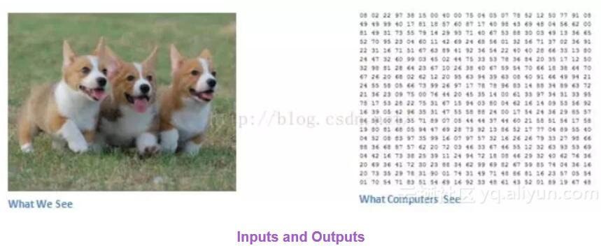

# deep_learning

### what is the difference between ML and DL?

机器学习，就是利用计算机、概率论、统计学等知识，通过给计算机程序输入数据，让计算机学会新知识，是实现人工智能的途径，但这种学习不会让机器产生意识。机器学习的过程，就是通过训练数据寻找目标函数。数据质量会影响机器学习精度，所以数据预处理非常重要。

深度学习是机器学习的一种，现在深度学习比较火爆。在传统机器学习中，手工设计特征对学习效果很重要，但是特征工程非常繁琐。而深度学习能够从大数据中自动学习特征，这也是深度学习在大数据时代受欢迎的一大原因。是机器学习的一类，本质上就是之前机器学习的神经网络算法。

深度学习目前在语音识别、图像识别等领域特别在行。

### what is the difference between keras and tensorflow?

......(体会不深因keras用的太少)

### what is the difference between numpy and pandas?

numpy: calculation on data like matrix multiply, etc.
pandas: load and format data

### largest data amount you handled

see BMA-2.docx Bayer Project

### what is reinforcement learning?

人的一生其实都是不断在强化学习，当你有个动作（action）在某个状态（state）执行，然后你得到反馈（reward），尝试各种状态下各种动作无数次后，这几点构成脑中的马尔可夫模型，使你知道之后的行为什么为最优。所以你现在才知道什么东西好吃，什么东西好玩。

加强学习最重要的几个概念：agent，环境，reward，policy，action。环境通常利用马尔可夫过程来描述，agent通过采取某种policy来产生action，和环境交互，产生一个reward。之后agent根据reward来调整优化当前的policy。

例子：撩妹的过程就是一个优化问题。你的每一时刻的行为会对你最终撩妹是否成功，以多大的收益成功都会有影响。那么，你就会考虑，每一步采取什么行为才能（最优）撩妹！这可以看作一个RL问题。你肯定迫不及待的想知道怎么去求解了！假设1:你是第一次撩妹。那么你会去求教他人，逛各种论坛，总之收集大量相关知识。这个过程就是experience data。利用离线数据来train一个model。假设2:过去你有很多撩妹经验。你似乎又发现总是按照套路来并不能成功。嗯，经典的探索与利用问题，于是你尝试了其他方法，你发现获得了更好的效果。嗯，more optimal policy将上述过程对应到RL中：action：你的行为state：你观察到的妹子的状态reward：妹子的反应：开心or不开心。

出处： https://www.zhihu.com/question/31140846

### Keras的Conv1d到Conv4d的区别

在Keras或者Theno或者TensorFlow中声明卷积层convolutional layer的时候，需要指明filter_shape is a tuple of (num_filter, num_channel, height, width)，即num_filter是卷积核个数，然后是通道数，filter的高乘以宽。疑问可以看这篇帖子：https://stackoverflow.com/questions/36243536/what-is-the-number-of-filter-in-cnn 

### 研究不同课题的最优卷积核以更好地提取特征甚至可以作为Phd的paper topic，人脸识别、猫狗识别都可使用不同的卷积核以获取不同的特征类别。

### 简述卷积神经网络Convolutional Neural Network CNN的大致过程和原理
下面是我们看到的图片和计算机看到的图片的区别： 
  
## 第一步，我们要做的就是添加卷积层Convolution layer求卷积，用filter（或者叫卷积核，滤波矩阵，kernel，neurons-神经元们，在Keras里我们可以自由指定卷积核的个数，一般第一个卷积层32个（32个卷积核，32种卷积核，32个神经元，得到32种feature map，获取到原图的32种特征），第二个64，第三个128，第四个256，都是16的倍数以方便GPU处理，也就是所使用的neurons的个数，越多第一层结束后提取出的feature maps就越多，也就是获取到了更多的原图的特征。比如我们进行人脸识别，就可以获取到这个人脸图的轮廓特征、颜色-肤色特征、五官位置特征等等，这些都是使用不同的神经元也就是卷积核“提取”出来的）。 
比如对下面这张32乘以32乘以3（最后的3代表RGB即channels也就是3原色的彩色图，如果我们的目标是字母A到Z这种无所谓颜色的，可以用cv软件处理成灰度图，那么channels就等于1了。当然你作人脸识别肯定用channels=1肯定不行，否则人的肤色就无法识别了）的图，经过多个5乘以5乘以3（最后一个3也是channels，要等于原图的channels）的卷积核扫描，变成了右侧32-5+1=28乘以28再乘以3（3也是通道数）的图： 
  
  
既然有卷积核filter，那就有stride步长（一次卷积核平移或纵移的位置）和padding（当卷积核扫描可能超出图片范围时，我们用啥来补其图片）一说。下面是stride的动图： 
  
  
  
讲padding的： 
  
## 第二步，卷积层后面加一个激活层Activation layer应用Relu Function
首先，为什么需要激活函数？ 模拟人的神经系统，只对部分神经元的输入做出反应。这样用Relu这种单侧抑制，有些神经元的输出就不会另我们做出反应。防止过拟合。 
其次，为什么采用非线性激活函数？如果是采用线性函数，那么多层神经网络也只有线性映射能力，输出都是输入的线性组合，与没有隐层一样。 
最后，采用哪些非线性激活函数？最常用的sigmoid,tanh,relu...在过去，研究人员主要利用双曲正切tanh或S函数sigmoid作为非线性函数进行处理，后来大家发现线性整流层ReLU效果更佳，由于其计算效率能够大大加快整个系统训练的速度。同时它能减轻梯度消失问题vanishing gradient problem，这个问题主要出现在训练时，由于梯度呈指数下降而导致的底层训练十分缓慢的问题。 
Relu主要用于每个卷积层之后紧跟的激活层，最后的激活层一般还是用Sigmoid因为output是classification，我们要知道猫狗辨别得到这个物体是猫的概率80%、是狗的概率15%、是鸟的概率5%这种。 
## 第三步，池化层（MaxPooling2D layer）作downsampling下采样
  
## 上面卷积层-激活层-池化层会有若干个
## 第四步，Flatten层-用来将输入“压平”，即把多维的输入一维化，常用在从卷积层到全连接层的过渡
## 第五步，全连接层Flatten()-对应Keras的Dense(256, activation='relu')
Dense就是常用的全连接层，所实现的运算是output = activation(dot(input, kernel)+bias)。其中activation是逐元素计算的激活函数，kernel是本层的权值矩阵，bias为偏置向量，只有当use_bias=True才会添加。 
全连接层相当于对之前所有卷积-激活-池化层得到的所有特征进行总结，然后依据这些特征将样本映射到对应的分类标记（0-猫，1-狗）上面去。比如： 
假设你是一只小蚂蚁，你的任务是找小面包。你的视野还比较窄，只能看到很小一片区域。当你找到一片小面包之后，你不知道你找到的是不是全部的小面包，所以你们全部的蚂蚁开了个会，把所有的小面包都拿出来分享了。全连接层就是这个蚂蚁大会~ 
  
  
  
  
  
  
## 第六步，Dropout层，Dropout(0.5)-为输入数据施加Dropout，Dropout将在训练过程中每次更新参数时按一定概率随机断开输入神经元（扔掉一些神经元），Dropout层用于防止过拟合

### CNN案例1：猫狗识别（医学影像肺癌检测）-cat_dog.html-使用keras
标准的convolutional neural network作图片classification。训练数据是600MB的猫和狗的图片，一共25000张.jpg，比如cat.18.jpg和dog.11853.jpg 
(200, 3, 64, 64)-经过处理后得到的training set-200张3通道RGB的64*64猫狗图片，声明为numpy的ndarray类型 
(10, 3, 64, 64)-test set 
  